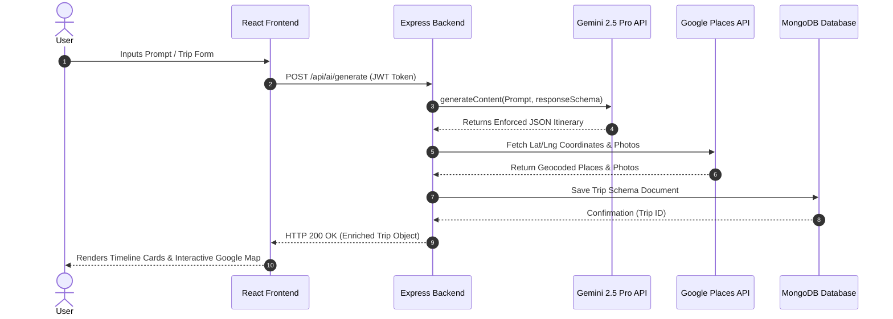

# 📊 STAGE 1: PRESENTATION 1 (Mid-Term Progress & Architecture Review)
## Project: TripXora — AI-Powered Dynamic Travel Planning Platform
**Total Slides:** 8 | **Evaluation Weightage:** Max 40 Marks

---

## 💻 SLIDE 1: Title Slide

```text
┌───────────────────────────────────────────────────────────────────────────────────────────┐
│                                                                                           │
│   [ DEPARTMENT LOGO ]                                             [ INSTITUTION LOGO ]    │
│                                                                                           │
│                                      TRIPXORA                                             │
│            An AI-Powered Dynamic Travel Planning & Smart Itinerary Platform               │
│                                                                                           │
│                      STAGE 1: MID-TERM PROGRESS & ARCHITECTURE REVIEW                     │
│                                    (Presentation 1)                                       │
│                                                                                           │
│   Group Number: [ Group # / Project ID ]                                                  │
│   Domain: Artificial Intelligence | Full-Stack Web GIS | Location-Based Services (LBS)   │
│                                                                                           │
│   Team Members:                                                                           │
│   1. [ Student Name 1 ] — Enrollment No: [ 0187CSXXXXX1 ]                                │
│   2. [ Student Name 2 ] — Enrollment No: [ 0187CSXXXXX2 ]                                │
│   3. [ Student Name 3 ] — Enrollment No: [ 0187CSXXXXX3 ]                                │
│                                                                                           │
│   Project Guide:                                                                          │
│   [ Prof. Guide Name ], Associate Professor, Dept. of Computer Science & Engineering       │
│                                                                                           │
└───────────────────────────────────────────────────────────────────────────────────────────┘
```

---

## 🎯 SLIDE 2: Problem Statement, Objectives & Expected Outcome (Unified 3-Box Layout)

```text
┌──────────────────────────────────┬──────────────────────────────────┬──────────────────────────────────┐
│ 🔴 BOX 1: PROBLEM STATEMENT       │ 🟡 BOX 2: CORE OBJECTIVES        │ 🟢 BOX 3: EXPECTED OUTCOME       │
├──────────────────────────────────┼──────────────────────────────────┼──────────────────────────────────┤
│ • Fragmented Travel Tools:       │ 1. AI Schema Engineering:        │ • Unified Web Travel Hub:        │
│   Users waste hours context-     │    Develop a natural-language    │   A single-page platform that    │
│   switching between maps, blogs, │    prompt parser using Gemini    │   reduces trip planning time     │
│   flight portals & spreadsheets. │    2.5 Pro enforcing strict JSON │   by 90% (from hours to          │
│                                  │    schema definitions.           │   seconds).                      │
│ • Static & Generic Itineraries:  │                                  │                                  │
│   Traditional generators output  │ 2. Dynamic AI Replanning:        │ • Context-Aware Personalized     │
│   rigid itineraries that fail    │    Implement a real-time AI    │   Itineraries: Day-by-day,       │
│   to adapt to real-time prompt   │    replanner to patch time gaps  │   hour-by-hour schedules         │
│   changes (e.g. "make day 2      │    and recalculate budgets on    │   tailored to budget, travel     │
│   cheaper").                     │    natural language feedback.    │   mode & hotel preferences.      │
│                                  │                                  │                                  │
│ • High Re-planning Friction:     │ 3. Multi-API Ecosystem:          │ • Integrated Live Transit &      │
│   Unforeseen mid-trip changes    │    Integrate Google Maps Places/ │   Interactive Maps: Seamless     │
│   require manually re-calculating│    Directions API with live      │   flight/train search with       │
│   time slots, route polylines &  │    AviationStack flight search   │   polylines, photo cards &       │
│   itemized budgets.              │    and train lookup engines.     │   direct booking shortcuts.      │
└──────────────────────────────────┴──────────────────────────────────┴──────────────────────────────────┘
```

---

## 📚 SLIDE 3: Literature Review Matrix & Research Gap

### Literature Review Matrix (Key Academic Papers)

| S.No | Paper Title & Citation | Authors & Publisher | Core Methodology | Identified Limitation / Research Gap |
| :--- | :--- | :--- | :--- | :--- |
| **1** | *AI-Driven Personalized Tourism Itinerary Recommendation Using Machine Learning* (2023) | J. Smith et al., **IEEE Trans. Intell. Transport** | Collaborative Filtering + Genetic Algorithms | Outputs static travel routes; cannot handle mid-trip real-time user modifications. |
| **2** | *Constraint-Based Route Optimization for Travel Logistics* (2022) | M. Kumar & R. Sharma, **Springer LNCS** | Constraint Satisfaction Problems (CSP) | Rule-based model; fails to parse free-form natural language user prompts. |
| **3** | *Generative AI in Smart Tourism: LLM Hallucination Challenges* (2024) | A. Gupta et al., **IEEE Access** | Unconstrained Large Language Models | LLM output hallucination causes broken JSON formatting & UI rendering crashes. |
| **4** | *Location-Based Services & Dynamic Route Visualisation in Web GIS* (2023) | L. Zhang et al., **Springer Mobile Networks** | WebGIS + Google Maps JS API | Visualizes map geometry only; lacks integrated budget logic & transit ticketing. |
| **5** | *Multi-Criteria Decision Making for Budget Vacation Planning* (2024) | P. Verma et al., **IEEE Intell. Systems** | Analytic Hierarchy Process (AHP) | Static cost matrices without real-time API flight pricing or custom stay categories. |

### 🔍 Identified Research Gap
> Existing platforms either provide **static non-interactive itineraries**, rely on **unconstrained LLMs susceptible to JSON hallucination**, or **lack live transit integration (flights/trains)** within an interactive Web GIS interface. **TripXora** bridges this gap by combining **schema-bound Gemini 2.5 Pro AI**, **real-time natural language replanning**, **live transit search**, and **interactive Google Maps rendering**.

---

## ⚙️ SLIDE 4: Proposed Methodology, Workflow & System Architecture

### 🔄 System Workflow Methodology
1. **User Prompt & Filter Input:** User provides natural language prompt or inputs details (Destination, Budget, Dates, Travelers, Hotel Type, Age Group).
2. **AI Schema Processing:** Backend passes input to `@google/genai` (Gemini 2.5 Pro) with strict `responseSchema` constraint (`tripParse.schema.js`).
3. **Geocoding & Place Enrichment:** System queries Google Places API to attach lat/lng coordinates, ratings, and high-res photos.
4. **Budget & Transit Computation:** `budget.service.js` calculates itemized cost breakdowns; `transit.controller.js` queries AviationStack API for live flights and IRCTC train schedules.
5. **Interactive Rendering & Dynamic Replanning Loop:** Itinerary renders on a responsive Glassmorphism dashboard with Google Maps route polylines. User prompts dynamically patch schedule gaps via `replanItinerary`.

### 🏗️ High-Level System Architecture Diagram

```text
┌───────────────────────────────────────────────────────────────────────────────────────────┐
│                                CLIENT LAYER (FRONTEND)                                     │
│  React 19 + Vite 8  │  Tailwind CSS v4 + Framer Motion  │  @react-google-maps/api           │
└─────────────────────────────────────────────┬─────────────────────────────────────────────┘
                                              │ Axios HTTPS (JWT Bearer Token Interceptor)
                                              ▼
┌───────────────────────────────────────────────────────────────────────────────────────────┐
│                                APPLICATION SERVER (BACKEND)                               │
│  Node.js + Express 5  │  JWT Auth Guards  │  Helmet & CORS Security  │ Express Validator    │
├──────────────┬──────────────────────────────┬──────────────────────────────┬──────────────┤
│ Auth Module  │      AI Engine Module        │       Transit Module         │ Trip Module  │
│ (Bcrypt/JWT) │ (Gemini 2.5 Pro Schema API)  │ (AviationStack Flight API)   │ (Mongoose)   │
└──────┬───────┴──────────────┬───────────────┴──────────────┬───────────────┴──────┬───────┘
       │                      │                              │                      │
       ▼                      ▼                              ▼                      ▼
┌──────────────┐     ┌─────────────────┐            ┌──────────────────┐   ┌────────────────┐
│  MONGODB 9   │     │ GOOGLE GEMINI   │            │ AVIATIONSTACK    │   │ GOOGLE MAPS    │
│ DATABASE     │     │ 2.5 PRO / FLASH │            │ FLIGHT API       │   │ PLACES/ROUTES  │
│ User/Trip DB │     │ JSON Schemas    │            │ Live Fares/Airlines│ │ Coordinates/   │
└──────────────┘     └─────────────────┘            └──────────────────┘   │ Photos API     │
                                                                           └────────────────┘
```

---

## 📐 SLIDE 5: UML System Design (Mandatory 4 Diagrams)

```mermaid
%%--- 1. USE CASE DIAGRAM ---
gantt
    title UML 1: Use Case Diagram Overview
    dateFormat  YYYY-MM-DD
```

### 1️⃣ Use Case Diagram (Textual Representation)
- **Actors:** Primary User, Gemini AI Service, Google Maps API, AviationStack API, Database System.
- **Key Use Cases:**
  - `UC1`: Register / Login User (JWT Security)
  - `UC2`: Create Trip via Prompt / Preferences Form
  - `UC3`: Parse Prompt to JSON Parameters (Gemini AI)
  - `UC4`: Generate Day-by-Day & Hourly Itinerary
  - `UC5`: Perform Real-Time Dynamic Replanning
  - `UC6`: Search Live Flights (AviationStack) & Trains
  - `UC7`: Render Route Polylines & Photo Preview (Google Maps)
  - `UC8`: Generate Category Packing List & Export

### 2️⃣ Sequence Diagram (Trip Generation & AI Processing)



### 3️⃣ Activity Diagram (Dynamic AI Replanning Flow)

```text
[Start] ──> (User Views Saved Itinerary)
               │
               ▼
         (Enters Replanning Prompt: e.g., "Make Day 2 cheaper")
               │
               ▼
         (Axios Sends POST /api/ai/replan with Current Itinerary Context)
               │
               ▼
         [AI Controller evaluates Prompt against Schema & Constraints]
               │
               ├───> Valid Replan? ───► [Yes] ──► (Patch Time Slots & Update Budget)
               │                                            │
               └───► [No Error] ────────────────────────────┤
                                                            ▼
                                                (Append to revisionHistory in MongoDB)
                                                            │
                                                            ▼
                                                (Re-render Updated Map Polylines & UI) ──► [End]
```

### 4️⃣ Class Diagram (Core System Models)

```text
┌───────────────────────────┐         1 : N         ┌───────────────────────────┐
│          User             │───────────────────────│          Trip             │
├───────────────────────────┤                       ├───────────────────────────┤
│ + _id: ObjectId           │                       │ + _id: ObjectId           │
│ + name: String            │                       │ + userId: ObjectId (FK)   │
│ + email: String           │                       │ + destination: Object     │
│ + passwordHash: String    │                       │ + startDate / endDate     │
│ + createdAt: Date         │                       │ + budget: Number          │
│                           │                       │ + preferences: Object     │
│ + register()              │                       │ + itinerary: Array<Day>   │
│ + login()                 │                       │ + revisionHistory: Array  │
└───────────────────────────┘                       └─────────────┬─────────────┘
                                                                  │ 1 : N
                                                                  ▼
┌───────────────────────────┐                       ┌───────────────────────────┐
│     ItineraryItem         │                       │       ItineraryDay        │
├───────────────────────────┤                       ├───────────────────────────┤
│ + timeSlot: String        │                       │ + dayNumber: Number       │
│ + activity: String        │                       │ + theme: String           │
│ + estimatedCost: Number   │                       │ + date: Date              │
│ + locationName: String    │                       │ + items: Array<Item>      │
│ + lat / lng: Number       │                       └───────────────────────────┘
│ + photoUrl: String        │
└───────────────────────────┘
```

---

## 🗄️ SLIDE 6: Database Schema, Entity Relationships & API Contracts (ER Diagram)

### Entity-Relationship (ER) Schema

```text
  ┌─────────────────────────────────┐
  │              USER               │
  ├─────────────────────────────────┤
  │ PK  _id           : ObjectId    │
  │     name          : String      │
  │     email         : String (UQ) │
  │     password      : String      │
  │     createdAt     : Date        │
  └────────────────┬────────────────┘
                   │
                   │ 1 : N (One User owns Many Trips)
                   ▼
  ┌─────────────────────────────────┐
  │              TRIP               │
  ├─────────────────────────────────┤
  │ PK  _id           : ObjectId    │
  │ FK  userId        : ObjectId    │
  │     destination   : { name, lat, lng }
  │     startDate     : Date        │
  │     endDate       : Date        │
  │     budget        : Number      │
  │     preferences   : { hotelType, travelMode, ageGroup, interests }
  │     itinerary     : Array [ DaySchema { dayNumber, items [...] } ]
  │     budgetBreakdown: { stay, food, transport, activities, total }
  │     revisionHistory: Array [ { prompt, timestamp, changes } ]
  │     createdAt     : Date        │
  └─────────────────────────────────┘
```

### Core API Contracts (RESTful Endpoints)

| Endpoint | Method | Security | Description & Payload |
| :--- | :---: | :---: | :--- |
| `/api/auth/register` | `POST` | Public | Registers new user; returns JWT token & user profile. |
| `/api/auth/login` | `POST` | Public | Authenticates user; returns JWT token. |
| `/api/ai/parse-prompt` | `POST` | Protected | Accepts raw prompt `{ prompt: string }` and returns structured JSON travel parameters. |
| `/api/ai/generate` | `POST` | Protected | Accepts trip parameters; calls Gemini SDK with strict schema & returns complete trip. |
| `/api/ai/replan` | `POST` | Protected | Accepts `{ tripId, prompt }`; updates itinerary time slots & appends revision log. |
| `/api/transit/flights` | `GET` | Protected | Query `?from=DEL&to=BOM&date=YYYY-MM-DD`; calls live AviationStack API. |
| `/api/transit/trains` | `GET` | Protected | Query `?from=NDLS&to=BCT`; returns class options (1A, 2A, 3A, SL) & IRCTC booking link. |

---

## 📸 SLIDE 7: Mid-Term Code Screenshots & Walkthrough (~40–50% Code Complete — No Live Demo)

```text
┌───────────────────────────────────────────────────────────────────────────────────────────┐
│ 📷 SCREENSHOT 1: Glassmorphism Authentication UI                                          │
│ • File: frontend/src/pages/Register.jsx & RegisterForm.jsx                                │
│ • Details: Full-viewport background (signup-bg.jpeg) with transparent backdrop-filter card │
│   card (rgba(255,255,255,0.40)), high contrast inputs, and JWT token storage flow.       │
├───────────────────────────────────────────────────────────────────────────────────────────┤
│ 📷 SCREENSHOT 2: Trip Parameter & Accommodation Preferences Form                          │
│ • File: frontend/src/features/trip-builder/TripForm.jsx                                  │
│ • Details: Includes budget slider, travel mode, age group, and newly added Hotel Type     │
│   dropdown (5-star, 4-star, budget, homestay, dharamshala, hostel).                      │
├───────────────────────────────────────────────────────────────────────────────────────────┤
│ 📷 SCREENSHOT 3: Interactive Dashboard with Google Maps & Day Timelines                   │
│ • File: frontend/src/pages/Dashboard.jsx & features/map/TripMap.jsx                       │
│ • Details: Real-time route polyline rendering, place marker popups, photo cards, and     │
│   hour-by-hour expandable activity timelines.                                             │
├───────────────────────────────────────────────────────────────────────────────────────────┤
│ 📷 SCREENSHOT 4: Live AviationStack Flight Search & Train Finder Drawer                  │
│ • File: frontend/src/features/transit/FlightSearch.jsx & TrainSearch.jsx                  │
│ • Details: Displays live airline badges (IndiGo, Air India), route timelines, flight fares, │
│   and direct MakeMyTrip "Book Now" buttons.                                               │
├───────────────────────────────────────────────────────────────────────────────────────────┤
│ 📷 SCREENSHOT 5: Gemini AI Strict JSON Schema Enforcement Code Snippet                    │
│ • File: backend/src/services/ai/schemas/tripParse.schema.js & ai.controller.js            │
│ • Details: Demonstrates @google/genai SDK v2.16 integration with responseSchema parameter │
│   preventing LLM hallucination and guaranteeing strict JSON parsing.                      │
└───────────────────────────────────────────────────────────────────────────────────────────┘
```

> **Progress Note:** Currently ~45% code complete (Authentication, Gemini AI Integration, Google Places/Maps API, Flight/Train Transit Search, Budget Engine, and Glassmorphism Dashboard are fully functional).

---

## 👥 SLIDE 8: Team Work Division & Phase-2 Final Sprint Timeline

### Work Division Matrix

| Team Member Name | Role | Module Responsibility | Key Deliverables Completed (Phase 1) |
| :--- | :--- | :--- | :--- |
| **[ Member 1 Name ]** | Frontend Lead | UI/UX & Google Maps | Glassmorphism Auth UI, Dashboard layout, `TripMap.jsx` polyline integration, `FlightSearch.jsx` UI. |
| **[ Member 2 Name ]** | AI & Backend Lead | Express API & Gemini AI | `@google/genai` schema integration, `ai.controller.js` (parser & replanner), AviationStack API integration. |
| **[ Member 3 Name ]** | Database & QA Lead | MongoDB & Security | Mongoose schemas (`Trip`, `User`), JWT Auth middleware, `ErrorBoundary.jsx`, Express Validator schemas. |

### 📅 Phase-2 Final Sprint Timeline (Gantt Chart Roadmap)

```text
Task / Milestone                 │ Wk 1-2 (Sep) │ Wk 3-4 (Oct) │ Wk 5-6 (Oct) │ Wk 7-8 (Nov)
─────────────────────────────────┼──────────────┼──────────────┼──────────────┼──────────────
Multi-City Route Optimization    │  ██████████  │              │              │
Weather API & Packing Sync       │              │  ██████████  │              │
PDF Itinerary Exporter & Sharing │              │              │  ██████████  │
Performance Audit & Security     │              │              │              │  ██████████
Final Report & Demo Preparation  │              │              │              │  ██████████
```

---
